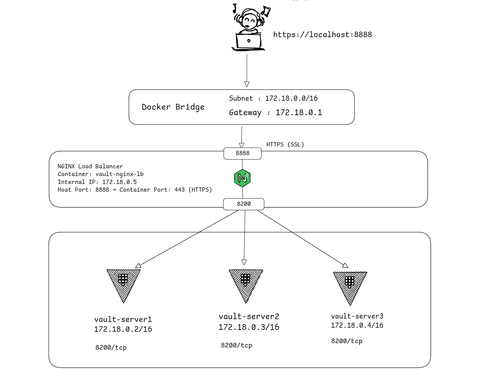

## Vault High Availability Architecture with NGINX Load Balancer (Docker-based)



## Architecture Overview

1. Vault Cluster

Nodes: 3 Vault servers
HA Mode: Enabled using RAFT storage backend for internal consensus and leader election
Ports: All Vault servers listen on port 8200

2. NGINX Load Balancer

Container Name: vault-nginx-lb
IP Address: 172.18.0.5 (internal Docker network)
Host Access:
    Listens on port 8888 on the host
    Internally forwards to port 443 (HTTPS)
SSL: Self-signed SSL certificate (vault-nginx.crt, vault-nginx.key)
Load Balancing Strategy: least_conn to evenly distribute requests to available Vault servers

3. Docker Network

Network Mode: Bridge
Subnet: 172.18.0.0/16
Gateway: 172.18.0.1


## Getting Started

Clone the repository and run 

```docker compose up``` 

URL: https://localhost:8888

NGINX handles HTTPS termination and forwards the requests to available Vault nodes.

